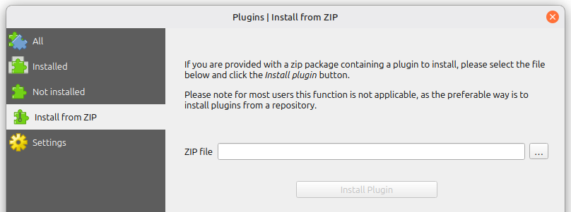
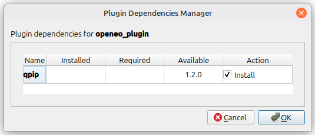
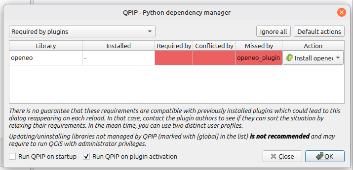
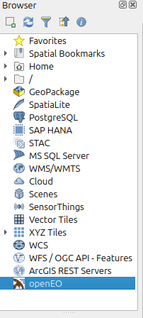

# openeo-qgis-plugin
QGIS Plugin to connect and use openEO compliant backends.

Compatible with backends compliant with openEO API version 1.0.0 and above.

Tested on Qgis 3.42

## About

The openEO QGIS Plugin "OpenEO" allows connecting to openEO backends, list the user ([batch](https://openeo.org/documentation/1.0/glossary.html#data-processing-modes)) jobs and load the resulting images into a new QGIS Layer. For creating process graphs, it is recommended to use the [openEO web editor](https://editor.openeo.org/).  

### Features

* List all openEO compliant backends listed at the [openEO Hub](http://hub.openeo.org/) 
* Connect to an openEO compliant backend
* Authenticate connections to backends: Supports:
    * Basic authentication (username, password)
    * OpenID Connect authentication (device code flow)
* List available collections, Web services, and Batch Jobs in the Qgis Browser
* Add Preview of available Collections as QGIS Layers
* Add web services as QGIS Layers
* Add Batch Job results as QGIS Layers
* View Details for:
    * Connections
    * Batch Jobs
    * Collections
    * Web Services
* View Batch Job logs
* Open the official openEO Web Editor in the systems system browser

#### File-/Service-type support
The Plugin supports the following file types of geodata for use within qgis

**Collections**:
| Service type | Support |
| -- | -- |
| [wmts](https://www.ogc.org/standards/wmts/)| Full |
| [xyz-tiles](https://xyzservices.readthedocs.io/en/stable/) | Full |

**Web Services**:
| Service type | Support |
| -- | -- |
| [wmts](https://www.ogc.org/standards/wmts/)| Full |
| [xyz-tiles](https://xyzservices.readthedocs.io/en/stable/) | Full |
   
**Batch-Job results**:
| File type | Data Type | Support |
| -- | -- | -- |
| [Geotiff](https://www.ogc.org/standards/geotiff/) | Raster | Full |
| [GeoJSON](https://geojson.org/) | Vector | Full |
| [Netcdf](https://docs.unidata.ucar.edu/netcdf-c) | Vector & Raster | Raster Only |
| [Geoparquet](https://geoparquet.org/releases/v1.1.0/) | Vector & Raster | Not yet supported |
| [ZARR](https://zarr.readthedocs.io/en/stable/) | Vector & Raster | Not yet supported |
| GIF/JPEG/PNG | Vector & Raster | Not yet supported |
| CSV | Vector | Not yet supported |
| JSON | Vector | Not supported by QGIS |
   
Need some additional features? Leave an issue at this repository!

## Install

There are two options on installing the plugin to your local QGIS Desktop application:

### Install via Plugin Browser

This is the recommended way if you want to get the most recent stable version of the plugin.

1. Start QGIS Desktop application
2. Go to "Plugins" and then "Manage and Install Plugins"
3. Go to "Settings" and make sure that "Show also experimental plugins" is activated
4. Go to "Not Installed" and search for "OpenEO"
5. Click on "OpenEO" and click "Install"
6. The openEO logo should be visible in the toolbar


### Install from GitHub repository

This is the recommended way if you want to get the **most recent** version of the plugin.

1. Download or clone the repository `git clone https://github.com/Open-EO/openeo-qgis-plugin`
2. Navigate into the plugin directory `cd openeo-qgis-plugin`
3. Compress the plugin directory as a ZIP file `zip -r openeo_plugin.zip openeo_plugin`(on Linux/Mac)
4. Start QGIS Desktop application
5. Go to "Plugins" and then "Manage and Install Plugins"
6. Go to "Install from ZIP", choose the newly created zip file, and click "Install Plugin"

    
7. The plugin "qpip" will be installed as a dependency. This is currently used to install the required openeo python client dependencies
	- Press "OK" on the Plugin Dependencies Manager prompt, then press "OK" on the qpip prompt 

    
    
8. After a successful installation, an "openEO" entry will be visible in the QGIS browser on the left side 

    

#### Installation Troubleshooting
If the installation of qpip or openeo does not happen automatically, try installing qpip beforehand using the plugin manager.

If use of qpip is not possible, `pip install openeo` may be used to install the necessary python dependency.

## Usage

1. After successful installation, an "openEO" entry will be visible in the QGIS Browser (the resource manager that can usually be found on the left side).
2. Create a new openEO connection by right clicking and either selecting a provider from the available list provided by openEO Hub or entering connection details by yourself.
3. You may now expand the openEO entry with the little "Plus" symbol that appears next to it.
4. (Optional) Right click on the created connection and select "log In" to authenticate your connection.
5. You can find collections, batch jobs, and web services that are visible to the authenticated user inside the folder icons with the corresponding names.

## Development

For setting up your development environment it is highly recommended to install the plugin-reloader plugin for qgis to prevent constant qgis restarts.
Once you have cloned the repository in your working directory, create a Symlink of the `openeo_plugin` folder into the `./python/plugins` directory that is located within your qgis profile directory. This will ensure that changes you make to the plugin will appear within qgis upon use of the plugin reloader.

example: (linux)
```sh
cd openeo-qgis-plugin
ln -s openeo_plugin /home/{USER}/.local/share/QGIS/QGIS3/profiles/default
```

To build the plugin GUI files you will need the [pb_tool](http://g-sherman.github.io/plugin_build_tool/) CLI tool.

To compile the ui of the plugin, run the `compile_ui.sh`-script in the root directory of this repository:
(note, this requires `pyqt6-tools` to be installed `pip install pyqt6-tools`)

```
./compile_ui.sh
```
     
Compiling is needed any time the resources.py file needs to be rebuilt and the .ui files are modified.

Upon changes to `.pre-commit-config.yaml`, run `pre-commit install`